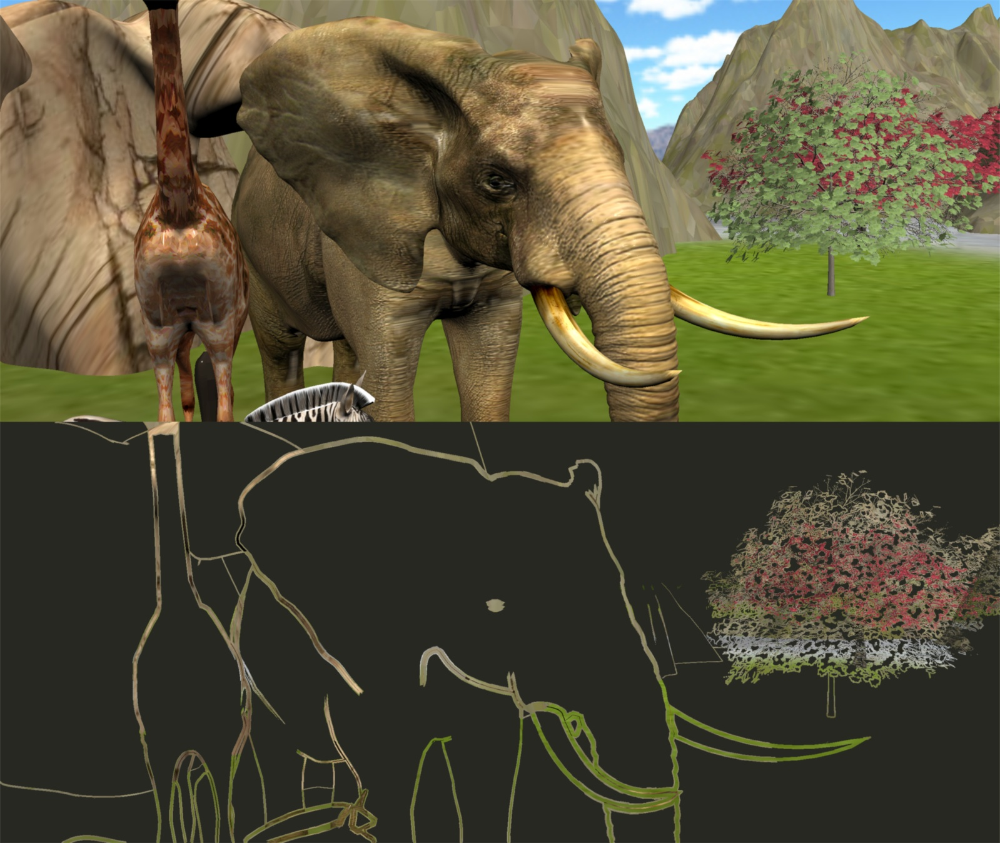

## Potentially Visible Hidden-Volume Rendering for Multi-View Warping Official Implementation of the ACM Trans. Graphics Paper (Proc. SIGGRAPH 2023) [Project](http://cg.skku.edu/pub/2023-kim-sig-pvhv) | [Paper](http://cg.skku.edu/pub/2023-kim-sig-pvhv)

This repository contains the official shader implementation of Effective Depth Peeling used in the following paper:

> [**Potentially Visible Hidden-Volume Rendering for Multi-View Warping**](http://cg.skku.edu/pub/2023-kim-sig-pvhv) 
>[Janghun Kim](http://cg.skku.edu/ppl/)1, [Sungkil Lee](http://cg.skku.edu/slee/)1 
> 1Sungkyunkwan University 
> *ACM Transactions on Graphics **(Proc. SIGGRAPH**) 2023* 

  

## Overview
This paper presents the model and rendering algorithm of Potentially Visible Hidden Volumes (PVHVs) for multi-view image warping. PVHVs are 3D volumes that are occluded at a known source view, but potentially visible at novel views. Given a bound of novel views, we define PVHVs using the edges of foreground fragments from the known and novel views. PVHVs can be used to batch-test the visibilities of source fragments without iterating individual novel views in multi-fragment rendering, and thereby, cull redundant fragments prior to warping. We realize the model of PVHVs in Depth Peeling (DP). Our Effective Depth Peeling (EDP) can reduce the number of completely hidden fragments, capture important fragments early, and reduce warping cost. We demonstrate the benefit of our PVHVs and EDP in terms of memory, quality, and performance in multi-view warping.

## Contributions
* definition and modeling of potentially visible hidden vol-
umes for multi-fragment rendering for multi-view warping;
* an effective depth peeling algorithm that realizes PVHV for
on-the-fly fragment culling